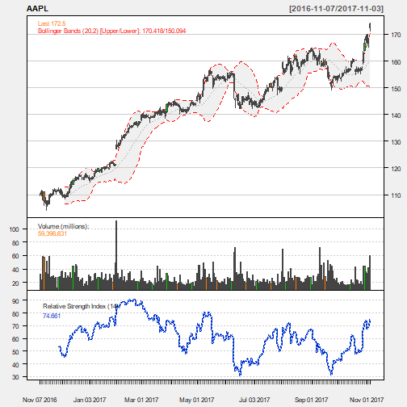

Developing Data Products 
========================================================
title: Hello World
author: Gopal Narra
date: 5 November 2017
autosize: true
width: 1440
height: 900

## Course Presentation

### Technical Stock Analysis Application


Introduction
========================================================

This presentation is part of the Coursera Developing Data Products course project. The assignment has two parts. First, a Shiny web application was created and published to shinyapps. Second, Rstudio Presenter was used to prepare a reproducible pitch presentation about the application. This presentation adresses the second part of the course project.

The app developed for the first part of the assignment is avalilable at:

https://gnarra.shinyapps.io/CourseProject-Shiny/

Source code for ui.R and server.R files are available on the GitHub:

https://github.com/gnarra/DataProducts/tree/master/CourseProject-Shiny

Basic Stock Analysis Application
========================================================

- This app helps you do a basic technical analysis of any US stock symbol data available from google financials. 
- The 'quantmod' package has many methods for technical analysis of stock data.
- 'getSymbols' function downloads the stock data from google financials.
- 'chartSeries' function plots the downloaded data with technical indicators.

First, you will need to pick the stock, date range to download the stock data from google financials in the application. Second, you need to choose the technical indicators that you want to plot for basic technical analysis.


Get Stock Data
========================================================


```r
library(quantmod)
stockData <- getSymbols("AAPL", src = "google", from = Sys.Date()-365, to = Sys.Date(), auto.assign = FALSE)
tail(stockData)
```

```
           AAPL.Open AAPL.High AAPL.Low AAPL.Close AAPL.Volume
2017-10-27    159.29    163.60   158.70     163.05    44454160
2017-10-30    163.89    168.07   163.72     166.72    44700772
2017-10-31    167.90    169.65   166.94     169.04    36046828
2017-11-01    169.87    169.94   165.61     166.89    33637762
2017-11-02    166.60    168.50   165.28     168.11    41393373
2017-11-03    174.00    174.26   171.12     172.50    59398631
```

Plot Stock data
========================================================


